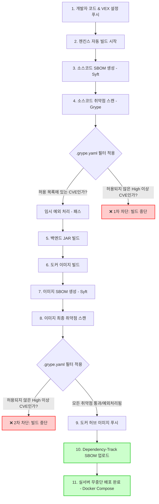

# 🛡️ VEX 통합 DevSecOps 보안 파이프라인 워크플로우

본 문서는 소스코드 커밋부터 최종 배포 및 **Dependency-Track 연동**까지, 취약점 검증과 **VEX (취약점 예외 처리)**가 결합하여 작동하는 실무 보안 파이프라인의 전체 흐름을 해설합니다.

---

## 📊 워크플로우 흐름도 (Flowchart)

---

## 📝 단계별 상세 해설

### 1단계. 개발자 코드 커밋 & VEX 설정 (`.grype.yaml`)
* 개발자가 라이브러리를 추가하거나 코드를 작성합니다.
* 만약 탐지될 취약점 중 프로젝트 비즈니스 상황상 즉시 업데이트가 불가능한 항목이 있다면, [`.grype.yaml`](file:///C:/Users/FINS/IdeaProjects/Community_board/.grype.yaml) 파일에 취약점 ID(CVE/GHSA)와 공식 사유를 기록하여 코드와 함께 Git에 푸시합니다.

### 2단계. 1차 관문: 소스코드 스캔 (Source SCA Scan)
* 젠킨스가 푸시를 감지해 기동됩니다.
* **`syft`**가 소스코드를 훑어 `build.gradle` 기반의 라이브러리 목록 파일(SBOM)을 추출합니다.
* **`grype`**가 이 명세서를 검사하되, 개발자가 제출한 **`.grype.yaml` 필터를 거쳐 등록된 취약점을 결과에서 제외(Ignore)**시킵니다.
* 필터링 후에도 남은 취약점 중 위험도가 **High 이상**인 항목이 하나라도 발견되면 ❌ **빌드를 즉시 중단(FAILURE)**시킵니다. 모두 안전하게 예외 처리되거나 취약점이 없다면 통과합니다.

### 3단계. 백엔드 빌드 및 도커 이미지 생성
* 1차 관문 통과 시, 소스코드를 컴파일하여 실행 가능한 `.jar` 파일을 빌드하고, 이를 도커 이미지로 최종 패키징합니다.

### 4단계. 2차 관문: 바이너리 이미지 스캔 (Binary SCA Scan)
* 이미지 빌드가 완료되면, 최종 배포 가능한 형태인 도커 이미지를 대상으로 **`syft`**가 이미지 내부 SBOM을 다시 추출합니다.
* **`grype`**가 최종 이미지를 재차 스캔하여, 패키징 과정에서 추가로 유입되었을 수 있는 OS 레이어 취약점 등을 검사합니다. (역시 `.grype.yaml` 필터가 적용됩니다.)
* 남은 High 이상 취약점이 발견되면 ❌ **배포 전 단계에서 빌드를 차단**합니다. 이상이 없다면 무사히 통과합니다.

### 5단계. 도커 허브 푸시
* 1, 2차 보안 관문을 모두 무결하게 통과한 **안전성이 검증된 정식 배포용 이미지**를 도커 허브 저장소로 안전하게 푸시합니다.

### 6단계. Dependency-Track SBOM 전송 (연동)
* **모든 보안 관문이 통과된 최종 청정 SBOM 문서**를 Dependency-Track 서버로 전송합니다.
* 서버에서는 수신한 최신 SBOM을 분석하여, **대시보드 화면에 그래프와 실시간 취약점 목록을 웅장하게 등록**합니다.

### 7단계. 실서버 최종 배포 (Deploy)
* 리눅스 VM의 docker-compose가 최신 검증된 안전한 이미지를 풀(Pull) 받아 서비스를 실행하고 배포를 완료합니다.

---

> [!NOTE]
> VEX 파일(`.grype.yaml`)을 통해 취약점을 정식으로 통과시켜야만 빌드가 안전하게 끝까지 완주하여 **최종 통과된 안전한 SBOM 정보가 Dependency-Track 대시보드에 동기화**됩니다.
