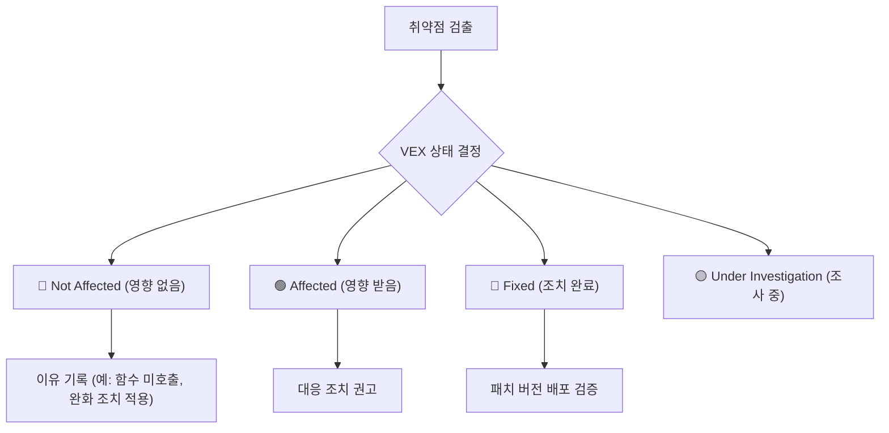

# 🛡️ VEX (Vulnerability Exploitability eXchange) 가이드

보안 취약점 관리와 SBOM(Software Bill of Materials)의 한계를 극복하기 위한 핵심 표준 규격인 **VEX (Vulnerability Exploitability eXchange)**에 대해 설명합니다.

---

## 1. VEX (Vulnerability Exploitability eXchange) 란?

**VEX**는 소프트웨어 제품에 포함된 특정 보안 취약점(CVE)이 **실제 런타임 환경에서 악용(Exploit) 가능한지 여부를 기계가 읽을 수 있는(Machine-Readable) 형태로 표명하는 문서 규격**입니다.

쉽게 말해, **"이 취약점(CVE)이 우리 프로그램에 감지된 것은 맞지만, 실제로는 동작하지 않거나 안전하게 방어되어 있으니 무시해도 안전하다"**라는 사실을 공식 증명서 형태로 전달하는 것입니다.

---

## 2. VEX가 왜 필요할까요? (SBOM의 한계 극복)

최근 보안 규제 강화로 인해 모든 배포 본에 SBOM을 첨부하는 것이 의무화되고 있습니다. 하지만 SBOM을 기반으로 취약점을 자동 스캔하면 심각한 **오경보(False Positive) 피로**에 직면하게 됩니다.

| 구분 | SBOM (자산 명세서) | VEX (취약점 실제 위험도 교환) |
| :--- | :--- | :--- |
| **핵심 질문** | "이 소프트웨어 안에 무엇이 들어 있는가?" | "포함된 취약점이 실제 작동/영향을 주는가?" |
| **문제점** | 코드 내부에서 실행되지 않는 데드 코드(Dead Code)나 OS 깊은 곳의 패키지까지 기계적으로 긁어모아 수백~수천 개의 취약점을 경고함. | 개발자나 보안 팀이 직접 취약점의 실제 악용 가능 여부를 분석하여 필터링하지 않으면 불필요한 빌드 차단이 남발됨. |
| **역할** | 원자재(라이브러리 목록) 식별 | 위험 수준의 실질적 필터링 및 예외 처리 가이드 제공 |

---

## 3. VEX의 4가지 핵심 상태 (Core Status)

VEX 표준 규격에서는 특정 취약점에 대해 다음과 같은 4가지 상태 중 하나를 지정하여 제공해야 합니다.



1. **Not Affected (영향 없음)**: 취약점이 제품 내에 존재하지만, 어떠한 방식으로도 악용될 수 없는 상태 (가장 중요)
   * *이유 예시*: 취약한 함수가 코드에서 호출되지 않음 (No code path), 방화벽/리버스 프록시 등의 장치로 보호됨 (Mitigated).
2. **Affected (영향 받음)**: 취약점이 실제로 악용 가능하며 동작에 영향을 주므로 해결책(패치 등)이 필요한 상태.
3. **Fixed (조치 완료)**: 이미 패치 버전이 반영되어 조치가 완료된 상태.
4. **Under Investigation (조사 중)**: 취약점의 실질 영향력을 아직 분석하고 있는 상태.

---

## 4. VEX 표준 포맷 종류

VEX는 다음과 같은 국제 표준 보안 문서 규격의 확장 플러그인 또는 독립 규격 형태로 지원됩니다.

* **CycloneDX VEX**: XML/JSON 기반의 SBOM 스펙 내부에 취약점 분석 결과를 함께 임베딩하는 방식 (가장 대중적).
* **CSAF (Common Security Advisory Framework)**: OASIS 표준으로 기업의 보안 권고문 발행 시 표준으로 쓰이는 규격.
* **OpenVEX**: 독립적인 초경량 JSON-LD 기반의 VEX 규격.

---

## 5. Grype의 실용적 VEX 연동 (`.grype.yaml`)

원래 완전한 VEX 연동을 위해서는 별도의 JSON/XML 문서를 만들어 스캔 시 병합해야 하지만, 스캐너 도구인 **Grype**는 개발 편의성을 위해 프로젝트 루트 폴더에 `.grype.yaml` 설정 파일을 생성해 VEX 문서와 동일한 효과(필터링)를 낼 수 있도록 지원합니다.

### 📝 설정 예시 (`.grype.yaml`)
```yaml
# Grype 스캔 시 특정 취약점 무시 설정 (VEX Concept)
ignore:
  - vulnerability: CVE-2023-45678  # 예외 처리할 취약점 ID
    reason: "The vulnerable class is never imported or initialized in our application."
  
  - vulnerability: CVE-2024-12345
    reason: "Mitigated by NGINX reverse proxy rate-limiting config."
```

이 파일을 프로젝트 루트에 저장하고 Git에 푸시하면, Jenkins 파이프라인 안의 `grype` 명령어 실행 시 해당 CVE 취약점들이 자동으로 감지에서 예외 처리되어 빌드가 정상 통과하게 됩니다.
